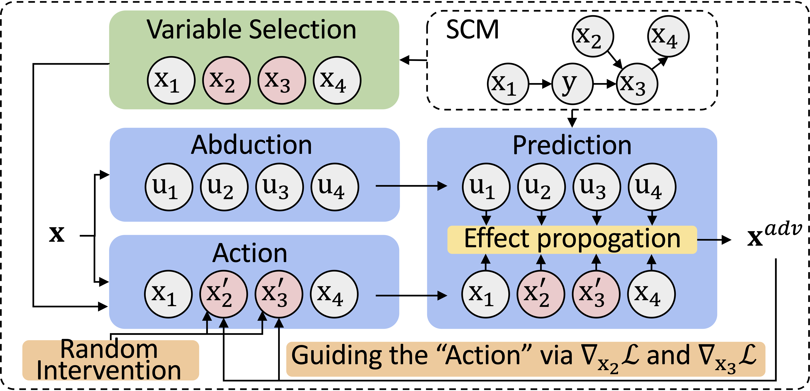

# Where and How to Attack? A Causality-Inspired Recipe for Generating Counterfactual Adversarial Examples

This repository is the official implementation of our paper [Where and How to Attack? A Causality-Inspired Recipe for Generating Counterfactual Adversarial Examples](https://arxiv.org/abs/2312.13628).
In this work we propose CADE, a framework that can generate Counterfactual ADversarial Examples.



## Example for latent
```
attacker = CADELatent(generative_model=generative_model, 
                      attacking_nodes=attacking_nodes, 
                      substitute=substitute, 
                      device=device)
                      
x_cade = attacker.attack_whitebox(x=x, 
                                  label=label, 
                                  lr=lr, 
                                  epochs=num_steps, 
                                  epsilon=epsilon,
                                  causal_layer=causal_layer
                                  )                  
```


## Example for observable
```
attacker = CADEObservable(causal_dag, 
                          attacking_nodes=np.array(l_attacking_nodes[mode]), 
                          y_index=y_index, 
                          substitute=model_base)
                          
x_cade = attacker.attack(endogenous=endogenous, 
                         epsilon=epsilon, 
                         causal_layer=causal_layer,
                         num_steps=num_steps,
                         lr=lr
                         )                                                   
```

## Experiment on Pendulum
### To reproduce the result on Pendulum, run 
```
python -u Experiment_CADE_Pendulum.py --substitute resnet50
```

```
python -u Experiment_CADE_Pendulum.py --substitute vgg16
```


## Experiment on CelebA
### To reproduce the result on CelebA, run 
```
python -u Experiment_CADE_CelebA.py --substitute resnet50
```

```
python -u Experiment_CADE_CelebA.py --substitute vgg16
```

## Experiment on SynMeasurement
### To reproduce the result on SynMeasurement, run 
```
python -u Experiment_CADE_SynMeasurement.py --substitute lin
```

```
python -u Experiment_CADE_SynMeasurement.py --substitute mlp
```

## Demos on Pendulum and CelebA:
[Demo_CADE_Pendulum.ipynb](Demo_CADE_Pendulum.ipynb)

[Demo_CADE_CelebA.ipynb](Demo_CADE_CelebA.ipynb)

## Download the checkpoints for the experiment, please visit:

https://drive.google.com/drive/folders/1khGEtAqlpKtLFspSKdz5zyObwpDGoLzV?usp=share_link

## Feel free to train the models from scratch:

### The causal generative models for Pendulum and CelabA are trained based on [this repository](https://github.com/xwshen51/DEAR)

### Train the attacking models:

[model_training/Pendulum/model_train_standard.py](model_training/Pendulum/model_train_standard.py)

[model_training/Pendulum/model_train_adversarial.py](model_training/Pendulum/model_train_adversarial.py)

[model_training/CelebA/model_train_standard.py](model_training/CelebA/model_train_standard.py)

[model_training/CelebA/model_train_adversarial.py](model_training/CelebA/model_train_adversarial.py)

[model_training/SynMeasurement/model_train_standard.py](model_training/SynMeasurement/model_train_standard.py)

[model_training/SynMeasurement/model_train_adversarial.py](model_training/SynMeasurement/model_train_adversarial.py)


